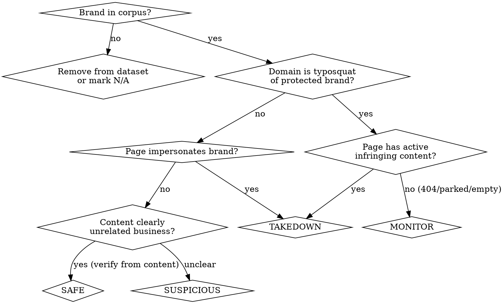
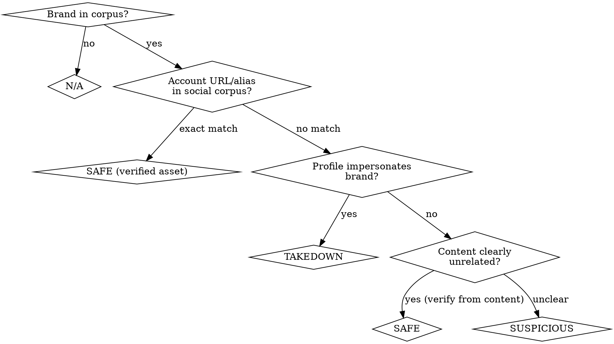

# Validating Ground Truths

## Overview

Ground truth expected files define what the LLM classifier SHOULD output for a given incident. Getting these wrong means the classifier optimizes toward wrong answers. This skill enforces the principles required to produce accurate ground truths, learned from real validation failures.

**Core rule: The brand/social corpus is the ONLY source of truth for entity verification. General knowledge is not evidence.**

## When to Use

- Reviewing or creating `*.expected.json` files for LLM classifier test datasets
- Auditing existing ground truth labels for correctness
- Evaluating whether a domain/social incident is a threat to a protected brand
- Any time you need to determine judgement, safeDomain, or tags for a test case

## Prerequisites

Before starting validation, you need access to:

1. **Brand corpus** — the complete list of protected brands, their official domains, and confusables
2. **Social corpus** — known official social media accounts per client
3. **Active clients** — client list with domain ownership
4. **Incident dataset files** — the actual enrichment data per incident
5. **LLM classifier rubric** — the workflow YAML and decision criteria the classifier uses

## The Five Principles

### 1. Corpus Is the Only Source of Truth

If an entity is not in the brand corpus or social corpus, you **CANNOT** vouch for it being legitimate.

```
NOT EVIDENCE:
- "This looks like a real company"
- "This account has 300K followers"
- "This person is the co-founder of X"
- "This is clearly the official account"
- "I know this is a legitimate project"

EVIDENCE:
- The exact URL/alias appears in the social corpus
- The domain appears in active_clients.domains
- The entity is listed in brand_info.officialDomains
```

If uncertain, keep the original judgement. Flag it for the client to clarify by adding it to their corpus.

### 2. Understand the Data Flow

```
LLM classifier outputs:
  → judgement (takedown/suspicious/safe/monitor)
  → safeDomain (which brand is being impersonated)
  → tags (evidence markers)

DOWNSTREAM rule engine uses safeDomain to set:
  → clientId (who to bill/notify)
```

**clientId is NOT an input to the LLM classifier** (except autohunt sources and social incidents where it's pre-set). The expected files validate what the LLM outputs. Do not use clientId as reasoning for your verdict.

### 3. Identify Tainted Data

Content-similarity classifiers (e.g., `f5-similar-inner-text-takedowns`, `f5-similar-title-takedowns`) compare page content against known takedowns. They produce **false matches** on:

- Cloudflare challenge/warning pages
- Vercel, GitHub Pages, Firebase default templates
- Generic hosting provider error pages
- CDN security interstitials

These matches are **tainted** — they reflect shared infrastructure, not brand impersonation. **Never use similarity classifier results as sole evidence** when the page shows generic infrastructure content.

Classifiers that are NOT tainted by this: typosquat analysis, domain string analysis, DNS/cert/ASN checks.

### 4. Typosquat Monitoring Principle

A domain that is a valid typosquat of a protected brand should be **monitor** even if:
- The page returns 404
- The page is parked/placeholder
- The page has no infringing content
- The scrape failed

The domain registration itself is the threat — it could activate at any time. Only mark a typosquat **safe** if the domain clearly belongs to an established, unrelated entity (verified by content, not by general knowledge claims).

### 5. Generic Word Principle

Common English words (sky, brave, oasis, paradigm, trezor) may be protected brand names AND legitimate words used by unrelated businesses. When a domain contains a protected brand name but the PAGE CONTENT clearly shows an unrelated business:

- Different industry (e.g., `apartments-sky.com` = real estate, not crypto)
- Different language (e.g., `paradigma74.ru` = Russian word, not paradigm.xyz)
- Established business with own branding visible in content

→ These are **safe**. But you must verify from the actual page content in the incident data, not from general knowledge about the entity.

## Judgement Values

| Judgement | When to use |
|-----------|-------------|
| **takedown** | Confirmed impersonation of a protected brand |
| **suspicious** | Ambiguous signals, needs human review |
| **safe** | No threat to any protected brand |
| **monitor** | Typosquat or brand-adjacent domain with no active infringing content |
| **N/A** | Cannot evaluate — target brand not in corpus, or insufficient data |

## Decision Framework

### Domain Incidents



### Social Incidents



**Social corpus matching rules:**
- Match must be **exact URL or alias** on the **same platform**
- A LinkedIn entry does NOT verify a Facebook account for the same brand
- A hash-based TikTok URL cannot be matched to an `@alias` entry without additional verification
- High follower count is not verification

## Signal Extraction

For each incident, extract these signals before making a judgement:

**Domain incidents:**
- Page title and inner text preview (actual content, not classifier interpretation)
- Typosquat classifier result and features (isTyposquat, jaroWinkler, levenshtein)
- HTTP status code and redirects
- DNS (NS, MX records), cert issuer, ASN org
- safeDomain and whether it exists in the domain corpus
- AI evaluator judgement and reasoning (but verify independently)

**Social incidents:**
- Profile name, alias, description
- Platform, follower count, creation date, tweet/post count
- Verification status
- Logo/image classifier results
- Fuzzy name match scores against corpus

**For both:** Check `classifierResults` but treat them as signals, not verdicts. The ground truth should reflect what the CORRECT output is, not what classifiers currently produce.

## Batch Processing Workflow

For large reviews (50+ cases):

1. **Extract signals** — Run `extract_signals.py` to pull key decision data from each incident
2. **Split into batches** — 25 cases per batch, separated by category (domain/social)
3. **Dual perspective per case** — Apply both the classifier rubric AND first-principles reasoning
4. **Flag conflicts** — When rubric and first-principles disagree, mark `[CONFLICT]` for human review
5. **Cross-check against corpus** — After all batches complete, verify every `safe` verdict against corpus
6. **Apply corrections** — Update expected files only after human review of disagreements

**Output format per case:**
```json
{
  "incidentId": "12345",
  "category": "domain",
  "current": {"judgement": "...", "safeDomain": "...", "tags": []},
  "finalVerdict": {"judgement": "...", "safeDomain": "...", "tags": [], "confidence": "high|medium|low"},
  "agrees": true,
  "rubricVerdict": {"judgement": "...", "reasoning": "..."},
  "firstPrinciplesVerdict": {"judgement": "...", "reasoning": "..."}
}
```

## Common Mistakes

These are real errors made during validation — each one corrupted ground truth data before being caught.

| Mistake | Example | Why it's wrong | Correct approach |
|---------|---------|----------------|------------------|
| "This is a legitimate project" | satoshiprotocol.pages.dev marked safe | Not in corpus — could be anyone's "dashboard" on free hosting | Keep as takedown; flag for client to add to corpus if legitimate |
| "This is the official account" | facebook.com/alixpartners marked safe | Facebook not in social corpus (only LinkedIn/Twitter are) | Keep original; platform must match corpus entry exactly |
| "High followers = real" | Bitkub TikTok (311K followers) marked safe | Hash URL ≠ @bitkubofficial in corpus; followers can be bought | Cannot verify without exact URL match |
| "Real person, real co-founder" | twitter.com/deacix (1inch co-founder) marked safe | Personal account not in social corpus | Keep original; personal accounts need explicit corpus listing |
| "Similarity classifier confirms threat" | join-elize.co marked suspicious based on similarity match | Match was on Cloudflare challenge page template (tainted) | Ignore tainted similarity data; evaluate domain name independently |
| "No clientId = no brand to protect" | usdtclaim.github.io marked N/A | clientId is set DOWNSTREAM from safeDomain — it's not an input | Check if the target brand is in corpus, not whether clientId exists |
| "Community account is harmless" | twitter.com/1inichNews marked safe | Not in corpus; "community" claim is unverifiable | Keep original; could be phishing with community disguise |
| "Common word, different industry" | Used general knowledge to verify | Knowing an entity exists ≠ corpus verification | Verify from PAGE CONTENT in the incident data, not external knowledge |

## Red Flags — Stop and Reconsider

If you find yourself thinking any of these, you are likely making an error:

- "I know this is a real company/person" → Is it in the corpus?
- "Obviously this is official" → Is the exact URL in the social corpus?
- "The similarity classifier confirms it" → Is the match on actual brand content or shared infrastructure?
- "There's no client for this brand" → Did you check if safeDomain maps to a corpus entry?
- "This has too many followers to be fake" → Follower count is not verification
- "The content looks legitimate" → Content can be cloned; verify the entity, not just the content
- "This fan account is transparent about being unofficial" → Transparency doesn't equal safety; not in corpus = not verified

## Expected File Format

```json
{
  "judgement": "monitor",
  "safeDomain": "example.com",
  "tags": ["typosquat"]
}
```

Maps to classifier output:
- `judgement` ↔ `result.features.judgement`
- `safeDomain` ↔ `result.safeDomain` (top level)
- `tags` ↔ `result.features.tags` (default `[]` if absent)

## Post-Validation Checklist

- [ ] Every `safe` verdict verified against brand + social corpus
- [ ] No verdicts based on general knowledge claims about entity legitimacy
- [ ] Similarity classifier matches checked for tainted data (shared templates)
- [ ] All typosquats of protected brands are `monitor` or `takedown`, not `safe`
- [ ] Incidents with brands not in corpus are `N/A` or removed
- [ ] safeDomain values reference actual domains in the corpus where possible
- [ ] Tags are consistent and descriptive
- [ ] Human has reviewed all disagreements before applying to expected files
- [ ] Validation script passes after changes
